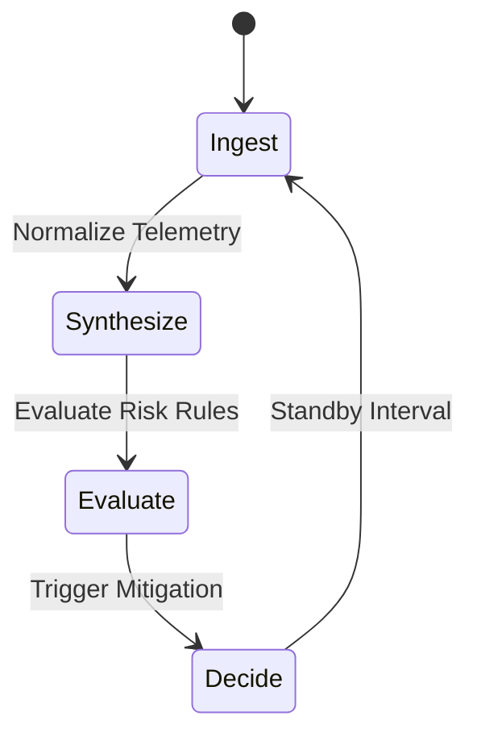

# Autonomous Agent Lifecycle

The Entropia autonomous agent operates through a deterministic 4-stage state machine cycle.

## Lifecycle States

1. **Ingest**: Ingest periodic metrics from host telemetry endpoints.
2. **Synthesize**: Apply mathematical weighting across the 6 survival dimensions.
3. **Evaluate**: Compare against deterministic safety boundaries and trigger risk warnings.
4. **Decide**: Propose or execute action gates (e.g. Filecoin deal negotiation, state pruning).
