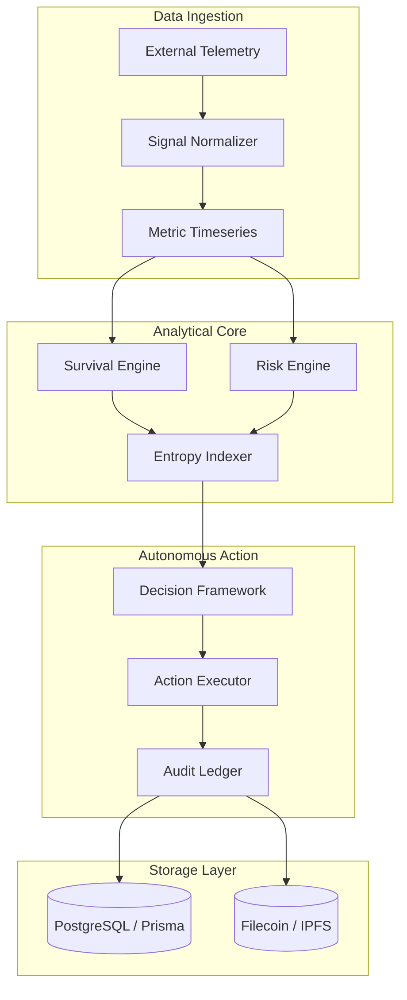

# System Architecture

Entropia is an autonomous, deterministic AI survival and risk analysis platform for complex multi-agent systems and mission-critical workflows.

## Core Modules

1. **Ingestion & Normalization (`lib/monitoring`)**: Ingests raw telemetry, scales metrics linearly or logarithmically, and outputs standardized values between 0.0 and 1.0.
2. **Survival Engine (`lib/survival`)**: Computes projected runway, resource half-life, and entropy progression using deterministic decay formulas.
3. **Risk Rules Engine (`lib/risk`)**: Evaluates system signals against tiered risk thresholds (Low, Moderate, High, Critical).
4. **Decision Framework (`lib/decisions`)**: Formulates autonomous corrective action vectors when risk exceeds defined safety tolerances.
5. **Decentralized Archival (`lib/filecoin`)**: Persists cryptographic proofs and immutable snapshots to Filecoin/IPFS for tamper-evident compliance.
